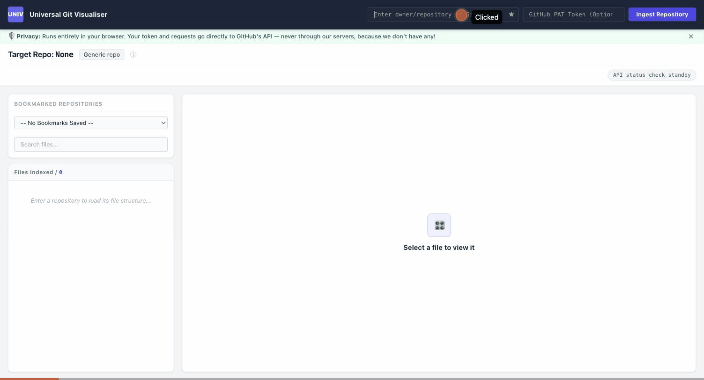

# Universal Git Visualiser & Setup Studio

**Zero-server, client-side GitHub repository explorer** that detects Agentforce Skills and Salesforce DX projects and hands you the exact CLI command to install or deploy them — no backend, no build step, your token never leaves your browser.

## What's happening in the demo

1. **Paste `forcedotcom/sf-skills` and hit Ingest** — the repo string is parsed and sent straight to the GitHub API from your browser.
2. **The tree renders** — 4,000+ files indexed and laid out in the Ecosystem Explorer pane on the left.
3. **Click a `SKILL.md` file** — the Ecosystem Profile Matrix flags this repo as *both* an Agentforce Skill registry and a Salesforce DX project, so both badges light up.
4. **Both detection cards appear side-by-side** — an `npx skills add` install command for the Agentforce side, and an `sf project deploy` command for the Salesforce DX side.
5. **Copy Command** — the exact terminal string is copied to your clipboard, confirmed with a toast notification.

## Live demo

[nimitwalia.github.io/universal-git-visualiser](https://nimitwalia.github.io/universal-git-visualiser/)

## How it works

- Paste any `owner/repository` or full GitHub URL and click **Ingest Repository** (or press Enter).
- The app fetches the repo tree directly from `api.github.com` — no proxy, no server in between.
- It scans the file tree for framework signatures and tags the repo accordingly:
  - **Agentforce Registry** — `skills/**/skill.md` or `skill.json` manifests present
  - **Salesforce DX** — `sfdx-project.json` present
  - **Node.js Module** — `package.json` present (and neither of the above)
  - **Generic Base** — none of the above; you still get a `git clone` command
- Click any file to preview its contents (rendered Markdown is sanitized with DOMPurify before display) and get the matching install/deploy command for that ecosystem.
- Optionally paste a fine-grained, read-only GitHub PAT to raise your rate limit above the unauthenticated 60 requests/hour — it's kept in `sessionStorage` by default (gone when you close the tab) unless you explicitly check "Remember token on this device," which persists it in `localStorage` until you clear it.

## Privacy

Everything runs client-side. Requests go directly from your browser to GitHub's API — there is no backend collecting your token or your browsing activity.
